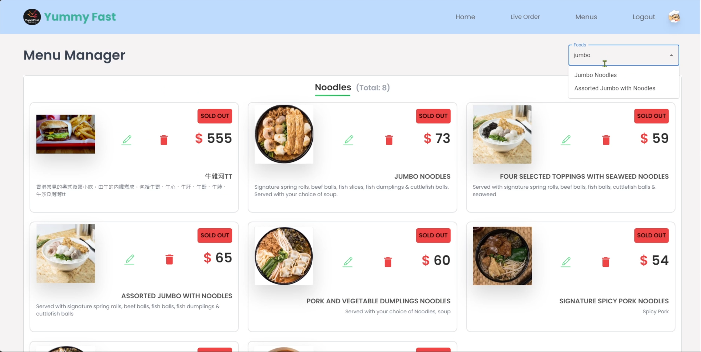
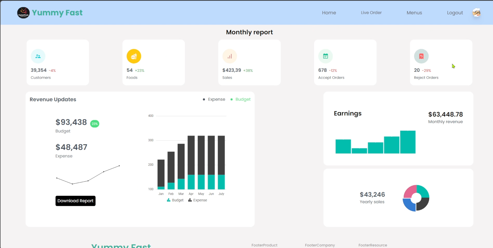
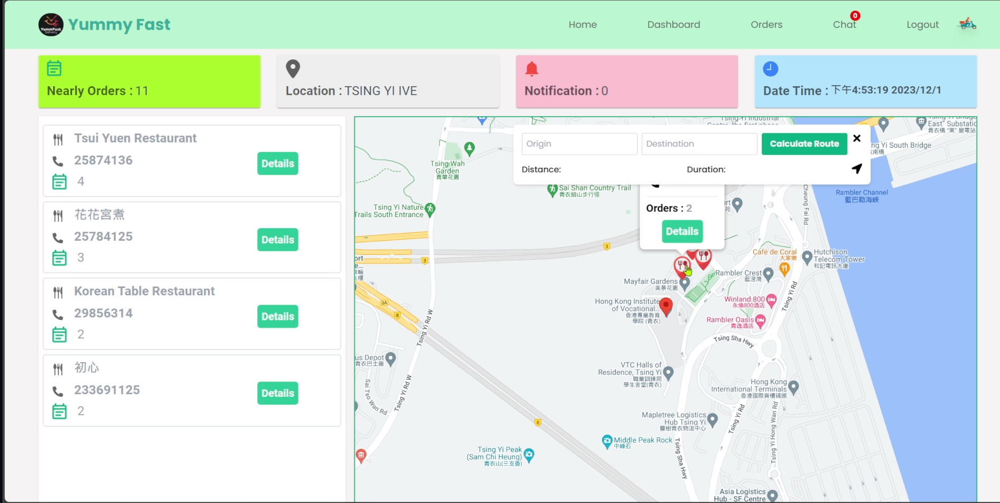

## 🧭 Features Overview

### 👤 Customers
- Browse and search restaurants and menu items
- Place orders with real-time progress tracking
- Review order history and give feedback
- Responsive UI for both desktop and mobile

### 🏪 Restaurant Staff
- Login and manage menus (CRUD for food items)
- Track and process customer orders
- Communicate with delivery personnel
- Dashboard for insights and order analytics

### 🛵 Delivery Personnel
- View available and assigned orders
- Receive route and delivery details
- Communicate with restaurant or customer
- Track completed jobs and earnings

## 🧑‍💻 UI/UX Highlights

### ✅ Human-Computer Interaction (HCI) Design Principles
- **User-friendly Interface**: Clean menu bar, clear feedback, tooltips, consistency
- **Error Tolerance**: Validation & real-time alerts on form errors
- **Progressive Disclosure**: Show advanced options only when necessary
- **Accessibility**: High contrast colors, larger font sizes, responsive layout
- **Cultural & Physical Differences**: Supports varied age, language, and motor abilities

### 🔍 Navigation & Visuals
- Intuitive icons based on common mental models (🛒 checkout, 📝 edit, 🗑️ delete)
- Hierarchical structure with vertical navigation
- Google Maps integration for route display
- Auto-complete in search for food or delivery routes

## 📌 Tasks & User Flows (HTA)

### 1. Order Food
- Login / Register
- Search/select restaurant
- Add food to cart → Checkout → Pay → Receive delivery

### 2. Sell Food
- Login → Create restaurant & food items → Save

### 3. Deliver Orders
- Login → Accept order → Read route → Deliver → Complete

## 📊 User Research & Testing
- Think-Aloud and Talk-After testing with user scenarios
- Role-playing sessions to simulate real usage
- Online surveys with feedback for UX refinement

## 🧱 Tech Stack
- **Frontend**: React.js, Material UI
- **Backend**: Node.js / Express / Firebase (depending on branch)
- **Other Tools**: Google Maps API, responsive CSS Grid

## 🖼️ UI Showcase - Partial

Here are some screenshots demonstrating the Yummy Restaurant System's interfaces:

###  Login page

###  Food Item

###  Dashboard

###  Delivery Personnel Interface

## 📚 References
- [How COVID-19 Popularized Food Delivery in HK](https://www.eats365pos.com/hk/en/blog/post/how-covid-19-popularized-food-delivery-in-hong-kong-263)
- [Material UI Docs](https://mui.com/)

---

